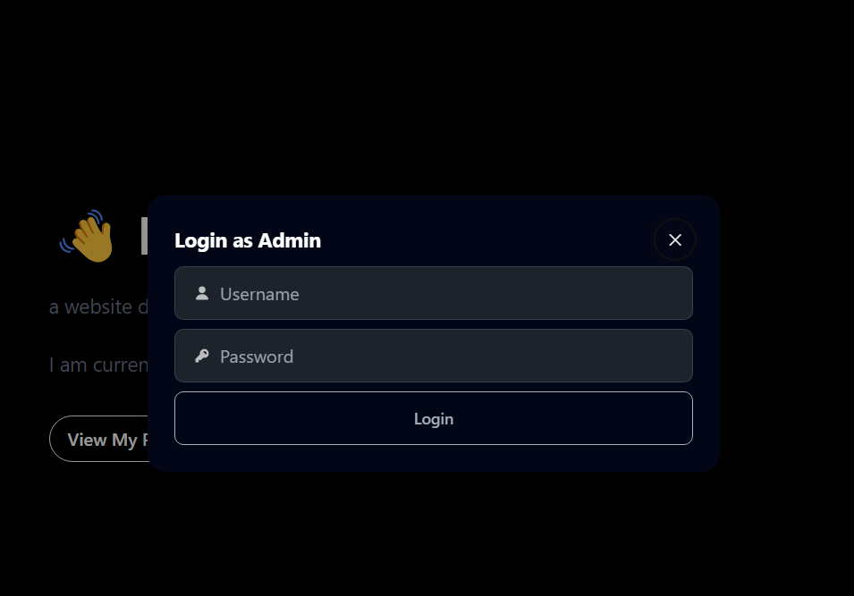

# Portofolio-v2

Portofolio-v2 adalah situs web portofolio yang dibangun menggunakan React Vite untuk frontend dan Node.js Express untuk backend. Proyek ini menampilkan kemampuan Anda sebagai web programmer dengan berbagai fitur interaktif.

## Fitur

1. **Autentikasi Pengguna**
   - Registrasi dan Login dengan enkripsi password menggunakan bcrypt.
   - Otentikasi menggunakan JWT token.

2. **Sistem Pengelolaan Portofolio**
   - Tambah, edit, dan hapus proyek portofolio.
   - Unggah gambar untuk setiap proyek.

3. **Animasi dan Desain**
   - Animasi interaktif menggunakan GSAP.
   - Desain komponen dengan teks berwarna emas tanpa latar belakang.

4. **Keamanan**
   - Perlindungan terhadap serangan path traversal.
   - Validasi input yang ketat.

## Dokumentasi


*Gambar 1: Modal Login*


*Gambar 2: Tampilan Home*


*Gambar 2: Tampilan About*


*Gambar 2: Tampilan Projects*


*Gambar 2: Tampilan Contact*


*Gambar 2: Tampilan Messages*

## Instalasi

Ikuti langkah-langkah berikut untuk menginstal dan menjalankan proyek ini secara lokal:

1. **Clone repositori**
    ```bash
    https://github.com/AjibFirdaus/Portofolio-v2-FE.git
    cd frontend
    ```

2. **Instal dependensi untuk frontend**
    ```bash
    npm install
    ```

3. **Jalankan aplikasi frontend**
    ```bash
    npm run dev
    ```

4. **Akses aplikasi (Harus sudah running program backend nya)**
    - Buka browser dan akses `http://localhost:5173` untuk melihat aplikasi.
